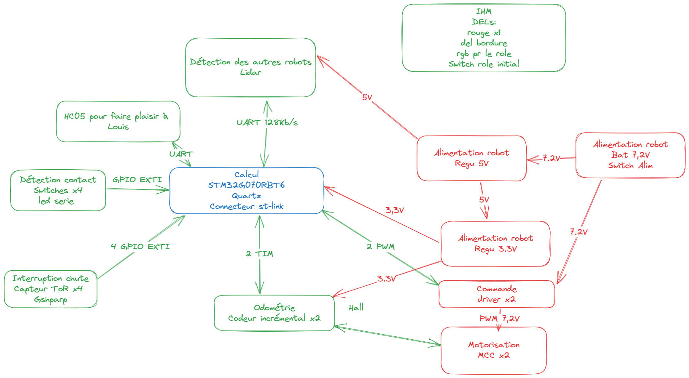

# ESE2024
    Emilie Butruille
    Louis Liénart
    Théo Césari
    Victor Lesne
------

Activer doxygen dans les propriétés du projet -> général C/C++, tuto doxygen https://www.youtube.com/watch?v=GC9Xy7nLxyw

Pour importer un projet sur cubeIDE, il faut faire "File" -> "Import" -> "General" -> "Project from Folder or Archive" puis sélectionner le directory (exemple "C:\Users\louis\Desktop\ProjetCubeIDE") et ensuite faire "finish".
Après ça, il faut régénérer des fichiers du code, donc cliquer sur "Device configuration tool Code generation"

Avec GitBash, pour retirer un fichier "add" par erreur faire un "git reset nom_du_fichier", un reset seul retirera tout les add fait.

Convention à avoir pour le stockage des sources :
pour stocker les lib créer faire un dossier source "Prod" avec comme sous-fichier "Inc" et "Src"
Ensuite les ajouter dans "Project" -> "Properties" -> "C/C++ General" -> "Paths and Symbols" -> "add" -> entrer "Prod/Inc" et faire ok.

Pour vérifier qu'une branch est ok, cloner un 2nd repo de la branch et la tester pour vérifier l'absence d'erreurs, sinon ça veut dire qu'il manque un truc au commit.

Ensuite il faut résoudre les conflits entre .cproject ( globalement garder le code du main ); .ioc (globalement fusionner les pins ajoutés et faire gaffe au pin, en double) et enfin le main.c ( où il faut fusionner )

